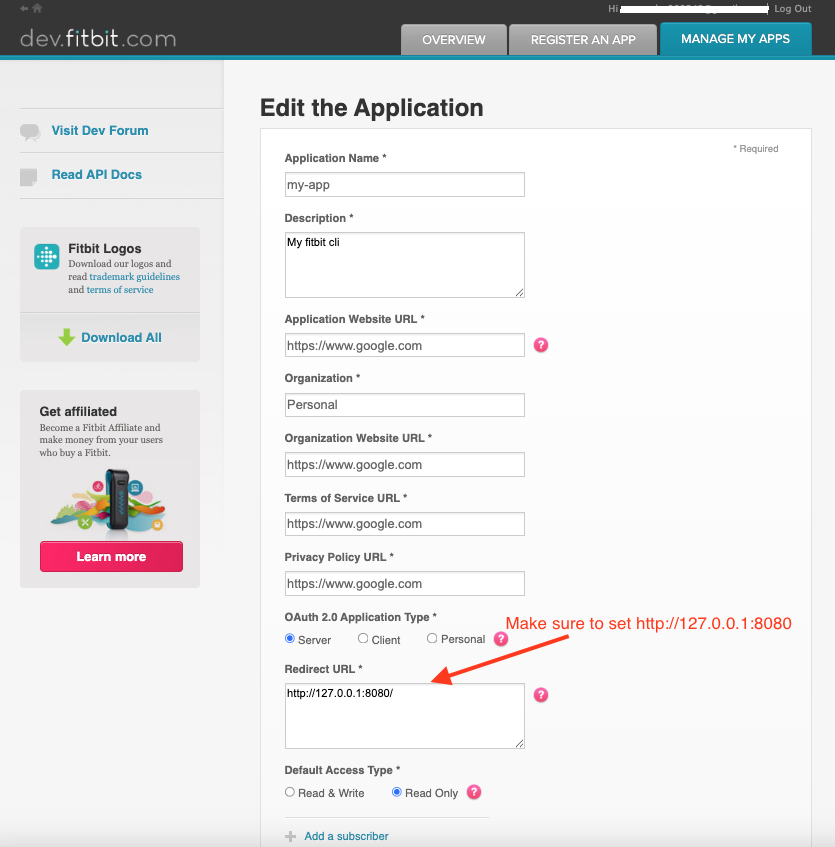

# Fitbit CLI

> ⚠️ This is not an official Fitbit CLI

Access your Fitbit data directly from your terminal 💻. View 💤 sleep logs, ❤️ heart rate, 🏋️‍♂️ activity levels, 🩸 SpO2, and more, all presented in a simple, easy-to-read table format!

<p align="center">
  
</p>

## Supported Web APIs

> Only `GET` APIs are supported!

| API                                                                                                                     | Status |
| ----------------------------------------------------------------------------------------------------------------------- | ------ |
| [User](https://dev.fitbit.com/build/reference/web-api/user/)                                                            | ✅     |
| [Sleep](https://dev.fitbit.com/build/reference/web-api/sleep/)                                                          | ✅     |
| [SpO2](https://dev.fitbit.com/build/reference/web-api/spo2/)                                                            | ✅     |
| [Heart Rate Time Series](https://dev.fitbit.com/build/reference/web-api/heartrate-timeseries/)                          | ✅     |
| [Active Zone Minutes (AZM) Time Series](https://dev.fitbit.com/build/reference/web-api/active-zone-minutes-timeseries/) | ✅     |
| [Activity](https://dev.fitbit.com/build/reference/web-api/activity/)                                                    | 👷     |

## Install

```bash
python -m pip install fitbit-cli

fitbit-cli -h
usage: fitbit-cli [-h] [-d | -i] [-s [DATE[,DATE]]] [-o [DATE[,DATE]]] [-e [DATE[,DATE]]] [-a [DATE[,DATE]]] [-u] [-v]

Fitbit CLI -- Access your Fitbit data at your terminal.

options:
  -h, --help            show this help message and exit
  -d, --json-dump       Dump all your Fitbit data in json files.
  -i, --init            Run interative setup to fetch token.
  -v, --version         Show fitbit-cli version

APIs:
  Specify date ranges (ISO 8601 format: YYYY-MM-DD) for the following arguments.
  You can provide a single date or a range (start,end). If not provided, defaults to today's date.

  -s, --sleep [DATE[,DATE]]
                        Sleep data
  -o, --spo2 [DATE[,DATE]]
                        SpO2 data
  -e, --heart [DATE[,DATE]]
                        Heart Rate Time Series
  -a, --active-zone [DATE[,DATE]]
                        Active Zone Minutes (AZM) Time Series
  -u, --show-user-profile
                        Show user profile data
```

## Register Fitbit App

1. Go to [https://dev.fitbit.com/apps](https://dev.fitbit.com/apps)
2. Click on "REGISTER AN APP" tab
3. Follow below example and register an app

<p align="left">
  
</p>

## Local Development

- [Fitbit Docs](https://dev.fitbit.com/build/reference/web-api/)
- [OAuth Tutorial](https://dev.fitbit.com/build/reference/web-api/troubleshooting-guide/oauth2-tutorial/)

```bash
git clone git@github.com:veerendra2/fitbit-cli.git
cd fitbit-cli

python -m venv venv
source venv/bin/activate
python -m pip install -e .
```
